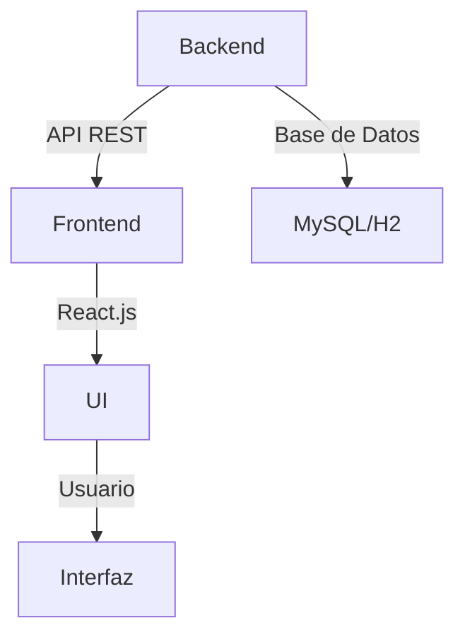
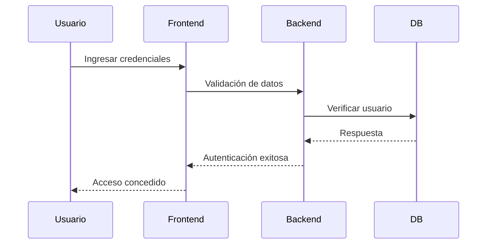
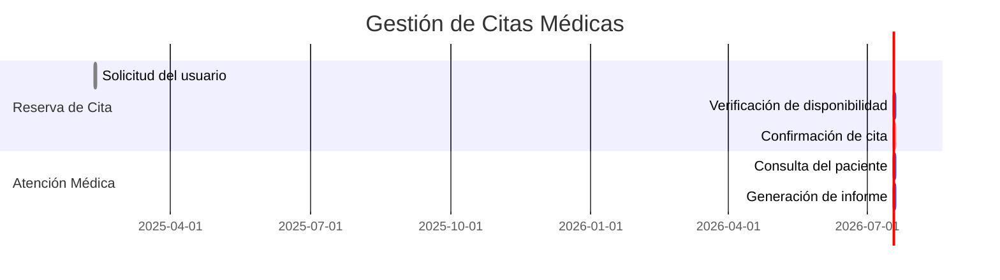

# 🏥 Aplicación de Gestión de Pacientes

## 📄 Información del Proyecto

**📌 Autor:** Juan David Salazar Ortiz  
**📆 Año:** 2024 - 2025  
**📍 Ciudad:** Madrid  
**📚 Asignatura:** Desarrollo de Interfaces - 2do de DAM  
**🏫 Centro:** CPIFP Los Enlaces - Zaragoza 


## 📖 Sobre el Proyecto

En este proyecto, he trabajado para desarrollar una solución innovadora que facilita la **gestión de pacientes en consultorios médicos pequeños**. Nuestra aplicación permite:

✅ Agendar citas médicas 📅  
✅ Descargar informes y justificantes 📄  
✅ Realizar pagos de servicios 💳  
✅ Acceder a un perfil personalizado 👤  


---

## 🛠️ Tecnologías Utilizadas

| Lenguaje/Framework | Descripción |
|--------------------|-------------|
| 🖥 **Java** | Backend con Spring Boot |
| 🔍 **H2/MySQL** | Base de datos |
| 🌐 **React.js** | Frontend interactivo |
| 🔗 **API REST** | Comunicación entre frontend y backend |

---

## 📂 Estructura del Proyecto



---

## 🚀 Instalación y Uso

### 1️⃣ Clona el Repositorio
```sh
git clone https://github.com/tu-usuario/app-gestion-pacientes.git
```

### 2️⃣ Configura el Backend
```sh
cd backend
mvn spring-boot:run
```

### 3️⃣ Ejecuta el Frontend
```sh
cd frontend
npm install
npm start
```

---

## 📊 Flujo de Autenticación



---

## 📌 Diagramas de Gestión de Citas



---

## 🎥 Video de Demostración

[](https://www.youtube.com/watch?v=572IhCYHIQQ)

---

## 📬 Contacto
📩 Si tienes dudas o sugerencias, contáctanos en: **juandvsalazar@gmail.com**

---

